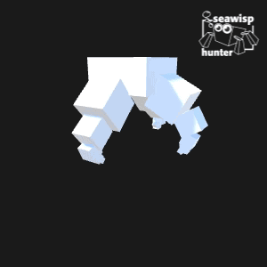

# minibuffer-arcadia-support




> Adds lisp support to [Minibuffer](http://seawisphunter.com/minibuffer/api/) using [Arcadia](http://arcadia-unity.github.io), a Clojure development environment for [Unity3D](http://unity3d.com/).

[Minibuffer](http://seawisphunter.com/minibuffer/api/) is a developer console for Unity. This project adds support for [Arcadia](http://arcadia-unity.github.io) so that you can use Lisp in Minibuffer and likewise add commands, variables, and key bindings.

## Background

## Install

Install Minibuffer and Arcadia into your project file. Then clone this repo into the `Assets/minibuffer/lisp` directory.

```
$ cd Assets/minibuffer
$ git clone git@github.com:shanecelis/minibuffer-arcadia-support.git lisp
```

## Usage

This code defines a new Minibuffer command and function called `say-hello`.  Once it has been evaluated, it can be called in Minibuffer by hitting 'M-x say-hello'

```
(defcmd say-hello
  "Say hello to x."
  [^String name]
  (message "Hi, %s, from Arcadia!" name))
```

## Contribute

PRs accepted.

## License

MIT © Shane Celis
